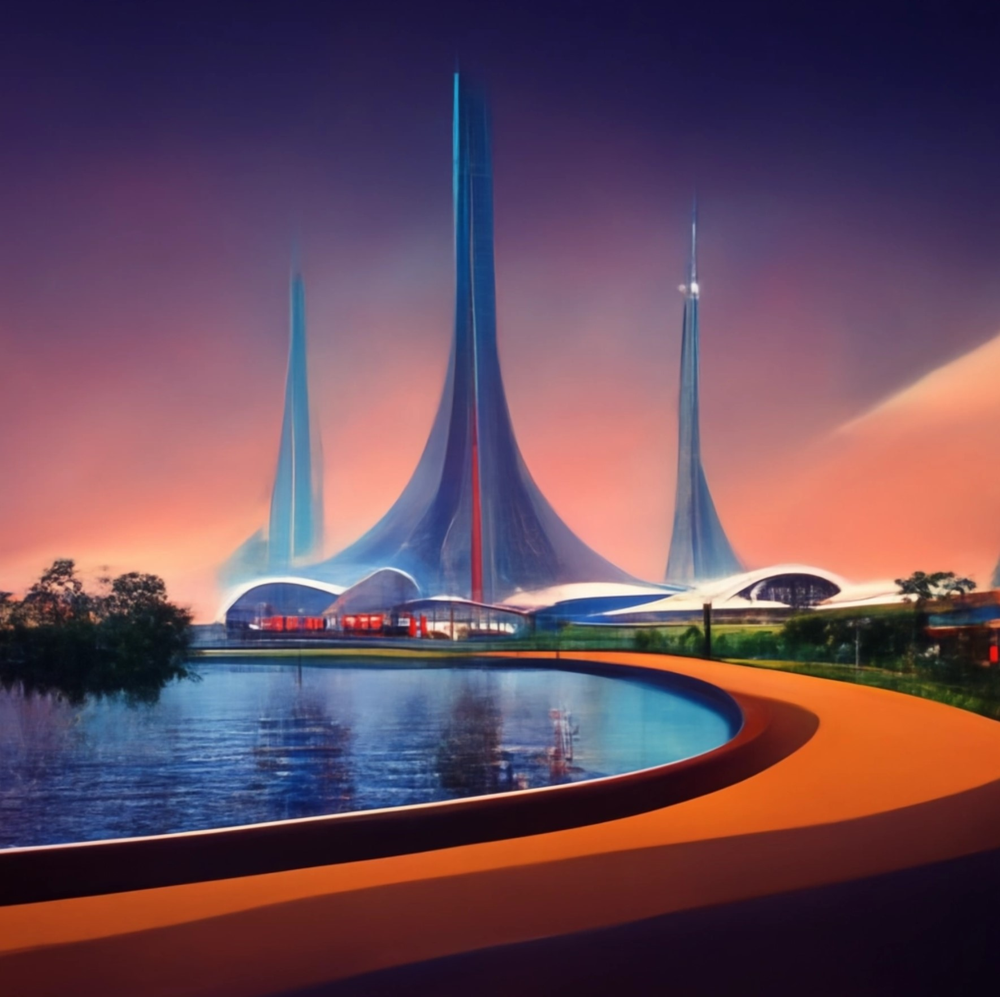

# LIT 3313H: Honors Science Fiction Literature

- **Instructor:** Dr. Anastasia Salter
- **Email:** anastasia@ucf.edu; Webcourses preferred
- **Office Hours:** TCH 236B, Tuesday / Thursday 10:30-11:30 AM
- **Course Meeting:** Tuesday / Thursday 12:00 - 1:15 PM
  
---

- **Credit Hours:** 3
- **Prerequisites:** Permission of Honors and ENC 1102H or equivalent credit.

## Contents

- [LIT 3313H: Honors Science Fiction Literature](#lit-3313h-honors-science-fiction-literature)
  - [Contents](#contents)
  - [Course Description](#course-description)
  - [Course Objectives](#course-objectives)
  - [Materials and Texts](#materials-and-texts)
  - [Evaluation and Grading](#evaluation-and-grading)
  - [Weekly Schedule](#weekly-schedule)
    - [Week One: Introduction (Tuesday, January 10)](#week-one-introduction-tuesday-january-10)
    - [Week One: 1900s (Thursday, January 12)](#week-one-1900s-thursday-january-12)
    - [Week Two: 1910s (Tuesday, January 17)](#week-two-1910s-tuesday-january-17)
    - [Week Two: 1920s (Thursday, January 19)](#week-two-1920s-thursday-january-19)
    - [Week Three: 1930s (Tuesday, January 24)](#week-three-1930s-tuesday-january-24)
    - [Week Three: 1940s (Thursday, January 26)](#week-three-1940s-thursday-january-26)
    - [Week Four: Entering the 1950s (Tuesday, January 31)](#week-four-entering-the-1950s-tuesday-january-31)
    - [Week Four: Earth and Stars (Thursday, February 2)](#week-four-earth-and-stars-thursday-february-2)
    - [Week Five: Strangers and Visitors (Tuesday, February 7)](#week-five-strangers-and-visitors-tuesday-february-7)
    - [Week Five: Closing the 1950s (Thursday, February 9)](#week-five-closing-the-1950s-thursday-february-9)
    - [Week Six: Entering the 1960s (Tuesday, February 14)](#week-six-entering-the-1960s-tuesday-february-14)
    - [Week Six: Wrath and Darkness (Thursday, February 16)](#week-six-wrath-and-darkness-thursday-february-16)
    - [Week Seven: Bodies (Tuesday, February 21)](#week-seven-bodies-tuesday-february-21)
    - [Week Seven: Closing the 1960s (Thursday, February 23)](#week-seven-closing-the-1960s-thursday-february-23)
    - [Week Eight: Into the 1970s (Tuesday, February 28)](#week-eight-into-the-1970s-tuesday-february-28)
    - [Week Eight: Names (Thursday, March 2)](#week-eight-names-thursday-march-2)
    - [Week Nine: Closing the 1970s (Tuesday, March 7)](#week-nine-closing-the-1970s-tuesday-march-7)
    - [Week Nine: Into the 1980s (Thursday, March 9)](#week-nine-into-the-1980s-thursday-march-9)
    - [Spring Break: Enjoy the holiday!](#spring-break-enjoy-the-holiday)
    - [Week Ten: Concluding Vint (Tuesday, March 21)](#week-ten-concluding-vint-tuesday-march-21)
    - [Week Ten: Artifice (Thursday, March 23)](#week-ten-artifice-thursday-march-23)
    - [Week Eleven: Art and Culture (Tuesday, March 28)](#week-eleven-art-and-culture-tuesday-march-28)
    - [Week Eleven: Drafts Due (Thursday, March 30)](#week-eleven-drafts-due-thursday-march-30)
    - [Week Twelve: Closing the 1980s (Tuesday, April 4)](#week-twelve-closing-the-1980s-tuesday-april-4)
    - [Week Twelve: Entering the 1990s (Thursday, April 6)](#week-twelve-entering-the-1990s-thursday-april-6)
    - [Week Thirteen: Transitions (Tuesday, April 11)](#week-thirteen-transitions-tuesday-april-11)
    - [Week Thirteen: Entering 2000 (Thursday, April 13)](#week-thirteen-entering-2000-thursday-april-13)
    - [Week Fourteen: Futures (Tuesday, April 18)](#week-fourteen-futures-tuesday-april-18)
    - [Week Fourteen: Conclusions (Thursday, April 20)](#week-fourteen-conclusions-thursday-april-20)
    - [Final Paper: Due During Exam Period](#final-paper-due-during-exam-period)
  - [General Policies](#general-policies)
    - [Gordon Rule and Academic Standards](#gordon-rule-and-academic-standards)
    - [Academic Integrity](#academic-integrity)
    - [Responses to Academic Dishonesty, Plagiarism, or Cheating](#responses-to-academic-dishonesty-plagiarism-or-cheating)
    - [Course Accessibility Statement](#course-accessibility-statement)
    - [Land Acknowledgement Statement](#land-acknowledgement-statement)
    - [Campus Safety Statement](#campus-safety-statement)
    - [Deployed Active Duty Military Students](#deployed-active-duty-military-students)
    - [Authorized Events and Religious Observances](#authorized-events-and-religious-observances)
  
---

## Course Description

<i>Epcot Center of the future, as generated by Midjourney</i>

This course will survey the history of science fiction with an emphasis on short stories, beginning with emerging works in the 19th century and spanning the so-called "Golden Age" and its aftermath. We will examine the genre's engagement with our changing relationship with technology, real and imagined, considering both utopian and dystopian visions and the role of shifting political and social landscapes in shaping the genre of science fiction.

Throughout our journey, we will read both works from recognizable "classic" authors as well as a selection of works from intersecting traditions and genres, including a number of works in translation. Our readings will follow a historical trajectory, allowing us to consider the shifting themes, conflicts, and ideologies of the works in question. Students will select 4 short stories for close readings based on their own thematic interests, and then complete a longer research paper putting a set of of stories into conversation.

Course outcomes consist of:

- **Weekly Readings, Discussion, and Lecture.** Note that readings are assigned for discussion on both Tuesdays and Thursdays prior to our scheduled in-person class meetings: while the works in question are all short stories or short essays, students are advised to consider the full week's readings when planning their time.
- **Close Readings.** Students will select 4 short stories for close readings based on their own thematic interests. Close readings should be on related stories for best results: ideally, these reading responses will serve as partial drafts of the research paper.
- **Final Research Paper.** In a final research paper and draft, students will draw connections across their selected short stories and build an argument for a significant theme, change, or conflict in the genre across time. The final research paper is due during our scheduled final exam period, and serves as the final evaluation for the course.

---

## Course Objectives

- Understand significant themes, conflicts, and movements across the history of science fiction
- Develop a historical perspective on science fiction, incorporating works spanning over a century of global storytelling
- Engage the short story as a format, considering style, structure, and authorial choices
- Build close reading skills through iterative analysis, working to incorporate both primary and secondary sources
- Analyze and critique works through a wide range of theoretical lenses

---

## Materials and Texts

This course uses a short story reader to minimize costs: note that in addition to being available through the UCF bookstore, this book is also frequently available at a lower cost from used booksellers. The secondary text is also accessible through free using the UCF library.

- Ann and Jeff Vandermeer, *The Big Book of Science Fiction.* Knopf Doubleday, 2016.
- Sherryl Vint, *Science Fiction.* MIT Press, 2021. [Unlimited use ebook available through UCF](https://ucf-flvc.primo.exlibrisgroup.com/permalink/01FALSC_UCF/faevv6/alma99383867776406596)
  
In addition, some weeks include selected essays. Those will be available on Webcourses as PDFs.

---

## Evaluation and Grading

| Points  | Assignment Summary | Due Date  |
|---|---|---|
| 5  | **Activity Verification** - Complete the brief survey posted on Webcourses as soon as possible to confirm your enrollment in the course. As this is required by the university, please attend to it as soon as possible at the start of classes. | Friday, January 13, 2022  |
| 60  | **Close Readings** - Close readings (4) require 500-750 word responses to a selected short story from the indicated timeframe building an interpretation of the text. Each reading should cite at least three secondary sources, and engage with the student's area of focus, building towards a larger paper project. GR. | Deadlines in Schedule |
| 15 | **Paper Draft** - Students will complete a larger paper drawing connections between disparate short stories and placing their selected works into conversation, with at least 10 sources in MLA style. Drafts should be 3000 - 3500 words. GR. | Thursday, March 30th  |
| 20 | **Final Paper** - Students will complete significant revision based on instructor feedback to complete a substantial research paper. Final papers should be 4000 - 4500 words. GR. | |

Students can access their grades and feedback at any time using the Grade Book function of Webcourses. All assignments will be submitted through Webcourses. Plan on checking the site at least twice a week for updates and assignment information. Grades are calculated out of 100 (all listed points above equated to 1% point) following the standard letter scale below:

| 93-100% | A |
| 90-93% | A- |
| 87-89% | B+ |
| 83-86% | B |
| 80-82% | B- |
| 77-79% | C+ |
| 73-76% | C |
| 70-72% | C- |
| 67-69% | C+ |
| 63-66% | C |
| 60-62% | C- |
| Under 60% | F |

Late work is accepted without penalty through the next major assignment deadline. If circumstances require extension beyond that deadline, please reach out to the instructor immediately.

## Weekly Schedule

### Week One: Introduction (Tuesday, January 10)

- Syllabus overview and expectations
- Discussion: Defining science fiction

### Week One: 1900s (Thursday, January 12)

- Introduction - Vandermeer
- The Star (1897) H. G. Wells
- Sultana's Dream (1905) Rokeya Sakhawat Hossain
- The Triumph of Mechanics (1907) Karl Hans Strobl
- **Due: Activity Verification (Friday January 13th)**

### Week Two: 1910s (Tuesday, January 17)

- Paul Scheerbart and the art of science fiction, C Partsch - Scheerbart.pdf
- The New Overworld (1911) Paul Scheerbart
- Elements of Pataphysics (1911) Alfred Jarry
- Mechanopolis (1913) Miguel de Unamuno
- The Doom of Principal City (1918) Yefim Zozulya

### Week Two: 1920s (Thursday, January 19)

- Vint - Introduction: Whose Science Fiction?
- Afrofuturism, science fiction, and the history of the future, Lisa Yaszek- Afrofuturism.pdf
- The Comet(1920) W. E. B. Du Bois
- The Fate of the Poseidonia (1927) Clare Winger Harris
- The Star Stealers (1965) Edmond Hamilton (variant of The Star-Stealers 1929)

### Week Three: 1930s (Tuesday, January 24)

- Vint - The Utopian Tradition
- The Conquest of Gola (1931) Leslie F. Stone
- A Martian Odyssey (1934) Stanley G. Weinbaum
- The Last Poet and the Robots (1934) A. Merritt
- The Microscopic Giants (1936) Paul Ernst

### Week Three: 1940s (Thursday, January 26)

- Idealism and Dystopia in Tlön, Uqbar, Orbis Tertius, John R. Clark - Borges.pdf
- Tion, Uqbar, Orbis Tertius (1940) Jorge Luis Borges 
- Desertion (1944) Clifford D. Simak
- September 2005: The Martian (1951) Ray Bradbury (variant of The Martian 1949)
- **Due: Close Reading #1**

### Week Four: Entering the 1950s (Tuesday, January 31)

- Vint - Futurology and Speculative Design
- Surface Tension  (1952) James Blish
- Beyond Lies the Wub (1952) Philip K. Dick
- The Snowball Effect(1952) Katherine MacLean
- Prott (1953) Margaret St. Clair
  
### Week Four: Earth and Stars (Thursday, February 2)

- Obituary - Clarke.pdf
- The Liberation of Earth (1953) William Tenn
- Let Me Live in a House (1954) Chad Oliver
- The Star (1955) Arthur C. Clarke
- Grandpa (1955) James H. Schmitz

### Week Five: Strangers and Visitors (Tuesday, February 7)

- Vint - The Colonial Imagination
- The Last Question (1956) Isaac Asimov
- Stranger Station (1956) Damon Knight
- Sector General (1957) James White
- The Visitors (1958) Arkady Strugatsky and Boris Strugatsky

### Week Five: Closing the 1950s (Thursday, February 9)

- The Short Story, Chris Power - Ocampo.pdf
- Pelt (1958) Carol Emshwiller
- The Man Who Lost the Sea (1959) Theodore Sturgeon
- The Waves(1959) Silvina Ocampo 
- Plenitude (1959)  Will Mohler
- **Due: Close Reading #2**

### Week Six: Entering the 1960s (Tuesday, February 14)

- Vint - Robots, AI, and Transhumanism
- The Voices of Time (1960) J. G. Ballard
- The Astronaut (1960) Valentina Zhuravlyova
- The Squid Chooses Its Own Ink (1962) Adolfo Bioy Casares 
- 2 B R 0 2 B (1962) Kurt Vonnegut, Jr.
  
### Week Six: Wrath and Darkness (Thursday, February 16)

- A Modest Genius (1963)  Vadim Shefner
- Day of Wrath (1965) Sever Gansovsky
- The Hands (1965) John Baxter
- Darkness (1963) Andre Carneiro
- "Repent, Harlequin!" Said the Ticktockman (1965) Harlan Ellison

### Week Seven: Bodies (Tuesday, February 21)

- Vint - Genomics, the Microbiome, and Posthumanism
- Nine Hundred Grandmothers(1966) R. A. Lafferty
- Day Million (1966) Frederik Pohl
- Student Body (1953) F. L. Wallace
- Aye, and Gomorrah (1967) Samuel R. Delany

### Week Seven: Closing the 1960s (Thursday, February 23)

- The Hall of Machines (1968) Langdon Jones
- Soft Clocks • (1968) Yoshio Aramaki
- No Cracks or Sagging (1970) David R. Bunch 
- New Kings Are Not for Laughing (1971) David R. Bunch
- **Due: Close Reading #3**

### Week Eight: Into the 1970s (Tuesday, February 28)

- Vint - Environment, Climate Change, and the Anthropocene
- Let Us Save the Universe (An Open Letter from Ijon Tichy) (1971) Stanslaw Lem
- Vaster Than Empires and More Slow (1971) Ursula K. Le Guin
- Good News from the Vatican (1971) Robert Silverberg
- When It Changed (1972) Joanna Russ

### Week Eight: Names (Thursday, March 2)

- Philosophical Insights from James Tiptree Jr, Michal Rea - Tiptree.pdf
- And I Awoke and Found Me Here on the Cold Hill's Side (1972) James Tiptree, Jr.
- Where Two Paths Cross (1973) Dmitri Bilenkin
- Standing Woman  (1974) Yasutaka Tsutsui

### Week Nine: Closing the 1970s (Tuesday, March 7)

- Vint - Economics and Financialization
- The IWM 1000 (1975) Alicia Yánez Cossío
- The House of Compassionate Sharers (1977) Michael Bishop
- Sporting with the Chid (1979) Barrington J. Bayley
- Sandkings (1979)  George R. R. Martin

### Week Nine: Into the 1980s (Thursday, March 9)

- Wives (1979) Lisa Tuttle
- The Snake Who Had Read Chomsky (1981) Josephine Saxton
- Reiko's Universe Box (1981) Kajio Shinji
- Swarm (1982) Bruce Sterling
- **Due: Close Reading #4**

### Spring Break: Enjoy the holiday!

### Week Ten: Concluding Vint (Tuesday, March 21)

- Vint - Conclusion
- Mondocane (1983) Jacques Barberi
- Blood Music (1983) Greg Bear
- Bloodchild (1984) Octavia E. Butler
- Variation on a Man (1984) Pat Cadigan

### Week Ten: Artifice (Thursday, March 23)

- Passing as a Flower in the City of the Dead (1984) Sharon N. Farber [as by S. N. Dyer]
- New Rose Hotel (1984) William Gibson
- Pots  (1985)  C. J. Cherryh
- Snow (1985) John Crowley
- The Lake Was Full of Artificial Things (1985) Karen Joy Fowler

### Week Eleven: Art and Culture (Tuesday, March 28)

- The Unmistakable Smell of Wood Violets (1991) Angélica Gorodischer
- The Owl of Bear Island (1986) Jon Bing
- Readers of the Lost Art (1987) Élisabeth Vonarburg
- A Gift from the Culture (1987) Iain M. Banks
- Paranamanco (1988) Jean-Claude Dunyach
  
### Week Eleven: Drafts Due (Thursday, March 30)

- Crying in the Rain (1987) Tanith Lee
- The Frozen Cardinal (1987) Michael Moorcock
- Rachel in Love (1987) Pat Murphy
- Sharing Air (1984) Manjula Padmanabhan
- **Due: Paper Draft**

### Week Twelve: Closing the 1980s (Tuesday, April 4)

- Schwarzschild Radius (1987) Connie Willis
- All the Hues of Hell (1987) Gene Wolfe
- Vacuum States (1988) Geoffrey A. Landis
- Two Small Birds (1988) Han Song
- Burning Sky (1989) Rachel Pollack

### Week Twelve: Entering the 1990s (Thursday, April 6)

- Before I Wake (1989) Kim Stanley Robinson
- Death Is Static Death Is Movement (1990) Misha Nogha
- The Brains of Rats (1986) Michael Blumlein
- Gorgonoids (1992) Leena Krohn
- Vacancy for the Post of Jesus Christ (1992) Kojo Laing

### Week Thirteen: Transitions (Tuesday, April 11)

- The Universe of Things (1993) Gwyneth Jones
- The Remoras (1994) Robert Reed
- The Ghost Standard (1994) William Tenn
- Remnants of the Virago Crypto-System (1995) Geoffrey Maloney
- How Alex Became a Machine (1997) Stepan Chapman

### Week Thirteen: Entering 2000 (Thursday, April 13)

- The Poetry Cloud (2003) Cixin Liu
- Story of Your Life (1998) Ted Chiang
- Craphound (1998) Cory Doctorow
- The Slynx (2007) Tatyana Tolstaya
- Baby Doll (2002) Johanna Sinisalo 

### Week Fourteen: Futures (Tuesday, April 18)

- [Charlie Jane Anders, Six Months, Three Days (2011)](https://www.tor.com/2011/06/08/six-months-three-days/)
- [Ken Liu, Paper Menagerie (2012)](https://gizmodo.com/read-ken-lius-amazing-story-that-swept-the-hugo-nebula-5958919)
- [Naomi Kritzer, Cat Pictures Please (2015)](https://clarkesworldmagazine.com/kritzer_01_15/)
- [N.K. Jemisin, The City Born Great (2016)](https://www.tor.com/2016/09/28/the-city-born-great/)
- [Annalee Newitz, #Selfcare (2021)](https://www.tor.com/2021/01/19/selfcare-annalee-newitz/)

### Week Fourteen: Conclusions (Thursday, April 20)

- Selected stories from 2022 (TBA)

### Final Paper: Due During Exam Period

- See UCF Calendar

## General Policies

### Gordon Rule and Academic Standards

This course is a Gordon Rule course. It contains 6000 words of evaluated writing as required by the English Department. Assignments which fulfill the Gordon Rule are marked in the assignments list as GR, and have the following characteristics:

1. The writing will have a clearly defined central idea or thesis
2. It will provide adequate support for that idea
3. It will be organized clearly and logically
4. It will show awareness of the conventions of standard written English
5. It will be formatted or presented in an appropriate way.

Short close readings serve as drafts for sections of the final paper, and should be expanded and refined through an iterative writing process building towards a full and revised draft.

### Academic Integrity

[The Center for Academic Integrity (CAI)](http://academicintegrity.org/) defines academic integrity as a commitment, even in the face of adversity, to five fundamental values: honesty, trust, fairness, respect, and responsibility. From these values flow principles of behavior that enable academic communities to translate ideals into action.

**UCF Creed:** Integrity, scholarship, community, creativity, and excellence are the core values that guide our conduct, performance, and decisions.

1. Integrity: I will practice and defend academic and personal honesty.
2. Scholarship: I will cherish and honor learning as a fundamental purpose of my membership in the UCF community.
3. Community: I will promote an open and supportive campus environment by respecting the rights and contributions of every individual.
4. Creativity: I will use my talents to enrich the human experience.
5. Excellence: I will strive toward the highest standards of performance in any endeavor I undertake.

Students should familiarize themselves with [UCF’s Rules of Conduct](https://scai.sdes.ucf.edu/student-rules-of-conduct/). According to Section 1, “Academic Misconduct,” students are prohibited from engaging in

1. Unauthorized assistance: Using or attempting to use unauthorized materials, information or study aids in any academic exercise unless specifically authorized by the instructor of record. The unauthorized possession of examination or course-related material also constitutes cheating.
2. Communication to another through written, visual, electronic, or oral means: The presentation of material which has not been studied or learned, but rather was obtained through someone else’s efforts and used as part of an examination, course assignment, or project.
3. Commercial Use of Academic Material: Selling of course material to another person, student, and/or uploading course material to a third-party vendor without authorization or without the express written permission of the university and the instructor. Course materials include but are not limited to class notes, Instructor’s PowerPoints, course syllabi, tests, quizzes, labs, instruction sheets, homework, study guides, handouts, etc.
4. Falsifying or misrepresenting the student’s own academic work.
5. Plagiarism: Using or appropriating another’s work without any indication of the source, thereby attempting to convey the impression that such work is the student’s own.
6. Multiple Submissions: Submitting the same academic work for credit more than once without the express written permission of the instructor.
7. Helping another violate academic behavior standards.
8. Soliciting assistance with academic coursework and/or degree requirements.

### Responses to Academic Dishonesty, Plagiarism, or Cheating

Students should also familiarize themselves with the procedures for academic misconduct in UCF’s student handbook, [The Golden Rule](https://goldenrule.sdes.ucf.edu/). UCF faculty members have a responsibility for students’ education and the value of a UCF degree, and so seek to prevent unethical behavior and respond to academic misconduct when necessary. Penalties for violating rules, policies, and instructions within this course can range from a zero on the exercise to an “F” letter grade in the course. In addition, an Academic Misconduct report could be filed with the Office of Student Conduct, which could lead to disciplinary warning, disciplinary probation, or deferred suspension or separation from the University through suspension, dismissal, or expulsion with the addition of a “Z” designation on one’s transcript.

### Course Accessibility Statement

This course is built with universal design for learning principles in mind: if you encounter challenges with any of the course materials, assignments, platforms, or requirements, please reach out for assistance, and know that additional support is always available regardles of documentation.

Additionally, the University of Central Florida is committed to providing access and inclusion for all persons with disabilities. Students with disabilities who need access to course content due to course design limitations should contact the professor as soon as possible. Students should also connect with [Student Accessibility Services (SAS)](http://sas.sdes.ucf.edu/) (Ferrell Commons 185, sas@ucf.edu, phone 407-823-2371). For students connected with SAS, a Course Accessibility Letter may be created and sent to professors, which informs faculty of potential course access and accommodations that might be necessary and reasonable. Determining reasonable access and accommodations requires consideration of the course design, course learning objectives and the individual academic and course barriers experienced by the student. Further conversation with SAS, faculty and the student may be warranted to ensure an accessible course experience.

### Land Acknowledgement Statement

The UCF Department of English acknowledges that our main campus stands on the traditional territories of the Seminole and Timucua peoples, and that other Native American traditional territories exist throughout Florida where our regional campuses are located. We collectively recognize their continuing connection to the land, water, and air and pay respect to their elders past, present, and emerging. We recognize the continuing consequences of colonialism on Indigenous peoples and their resilience in the face of colonial and state sponsored violence, and we fully endorse Indigenous Sovereignty.

### Campus Safety Statement

Emergencies on campus are rare, but if one should arise during class, everyone needs to work together. Students should be aware of their surroundings and familiar with some basic safety and security concepts.

- In case of an emergency, dial 911 for assistance.
- Every UCF classroom contains an emergency procedure guide posted on a wall near the door. Students should make a note of the guide’s physical location and review the [online version](http://emergency.ucf.edu/emergency_guide.html).
- Students should know the evacuation routes from each of their classrooms and have a plan for finding safety in case of an emergency.
- If there is a medical emergency during class, students may need to access a first-aid kit or AED (Automated External Defibrillator). To learn where those are located, see [locations](https://ehs.ucf.edu/automated-external-defibrillator-aed-locations).
- To stay informed about emergency situations, students can sign up to receive UCF text alerts by going to [MyUCF](https://my.ucf.edu) and logging in. Click on “Student Self Service” located on the left side of the screen in the toolbar, scroll down to the blue “Personal Information” heading on the Student Center screen, click on “UCF Alert”, fill out the information, including e-mail address, cell phone number, and cell phone provider, click “Apply” to save the changes, and then click “OK.”
- Students with special needs related to emergency situations should speak with their instructors outside of class.
- To learn about how to manage an active-shooter situation on campus or elsewhere, consider viewing this [video](https://youtu.be/NIKYajEx4pk).

### Deployed Active Duty Military Students

Students who are deployed active duty military and/or National Guard personnel and require accommodation should contact their instructors as soon as possible after the semester begins and/or after they receive notification of deployment to make related arrangements.

### Authorized Events and Religious Observances

Students who represent the university in an authorized event or activity (for example, student-athletes) and who are unable to meet a course deadline due to a conflict with that event must provide the instructor with documentation in advance to arrange a make-up. No penalty will be applied.

Students must notify their instructor in advance if they intend to miss class for a religious observance. For more information, see the [UCF policy](http://regulations.ucf.edu/chapter5/documents/5.020ReligiousObservancesFINALJan19.pdf).
